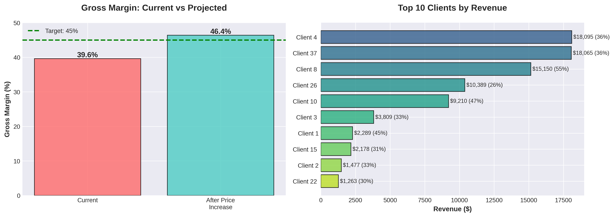
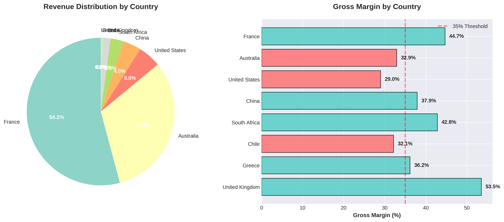
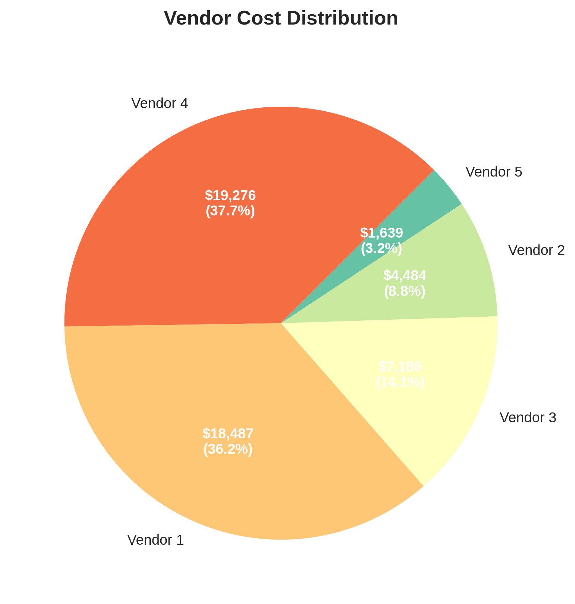
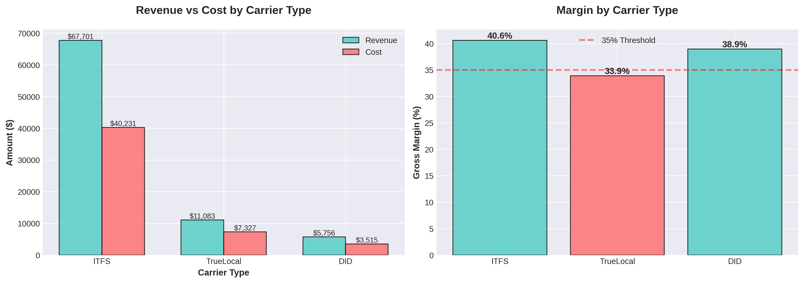

# 📊 AVOXI Billing Analysis

> Comprehensive telecommunications billing analysis with margin optimization and vendor cost evaluation

[](https://www.python.org/)
[](LICENSE)
[]()

## 📋 Project Overview

This project analyzes three months of telecommunications billing data to identify margin optimization opportunities and provide actionable recommendations for pricing strategy. The analysis examines $84,540 in revenue across multiple dimensions including clients, countries, carriers, and vendors.

### Key Findings

- **Current Gross Margin:** 39.59%
- **Projected Margin:** 46.37% (with recommended pricing adjustments)
- **Cost Structure:** 5 vendors with varying billing methods
- **Client Base:** 53 active clients across 8 countries

## 🎯 Business Problem

AVOXI needed to:
1. Understand current profitability across different business segments
2. Identify low-margin clients and countries requiring attention
3. Optimize vendor routing to reduce costs
4. Develop pricing strategy to achieve 45%+ gross margin target

## 💡 Methodology

### Data Analysis Pipeline

```
Raw Billing Data → Data Processing → Multi-dimensional Analysis → Visualization → Recommendations
```

The analysis examines:
- **Client Performance:** Revenue, cost, and margin by individual client
- **Geographic Analysis:** Profitability by country and region
- **Carrier Breakdown:** Performance across different number types (ITFS, TrueLocal, DID)
- **Vendor Efficiency:** Cost structure and billing method impact
- **Scenario Modeling:** Impact of pricing adjustments on overall margin

### Technical Approach

1. **Data Aggregation:** Consolidated call records with rate tables
2. **Margin Calculation:** Applied different billing increments per vendor
3. **Segmentation Analysis:** Identified low-margin segments requiring optimization
4. **Scenario Planning:** Modeled pricing changes impact on margins

## 📊 Key Visualizations

### 1. Margin Improvement Scenario


### 2. Country Performance


### 3. Vendor Cost Distribution


### 4. Carrier Analysis


## 🔍 Key Insights

### Revenue & Margin Analysis
- Current revenue: **$84,540.40**
- Current margin: **39.59%**
- Projected margin with price increase: **46.37%** ✅ (exceeds 45% target)

### Low Margin Segments Identified

**Countries requiring attention:**
- 🇺🇸 United States: 28.99% margin
- 🇨🇱 Chile: 32.15% margin
- 🇦🇺 Australia: 32.91% margin

**Top Clients by Revenue:**
- Client 4: $18,095 (36.30% margin)
- Client 37: $18,065 (36.31% margin)
- Client 8: $15,150 (54.61% margin) ⭐

### Vendor Efficiency

| Vendor | Cost Share | Billing Method | Efficiency |
|--------|-----------|----------------|------------|
| Vendor 4 | 37.7% | First 30s, then every 6s | 1.03× |
| Vendor 1 | 36.2% | Every 6s | 1.01× |
| Vendor 3 | 14.1% | Per minute | 1.14× |
| Vendor 2 | 8.8% | Per second | 1.00× ⭐ |
| Vendor 5 | 3.2% | Every 30s | 1.09× |

> **Note:** Vendor 2's per-second billing provides best efficiency for short calls

## 💼 Recommendations

### 1. ✅ Implement Pricing Adjustments
- **Landline rates:** Increase by 20%
- **Mobile rates:** Increase by 7%
- **Expected outcome:** Achieve 46.37% margin (exceeds 45% target)

### 2. 🔄 Optimize Call Routing
- Route short-duration calls to Vendor 2 (per-second billing)
- Potential cost savings: ~3-5% on applicable traffic
- Maintain quality standards during transition

### 3. 🎯 Address Low Margin Segments
- **Priority 1:** Review pricing for US, Chile, and Australia
- **Priority 2:** Renegotiate rates with low-margin clients
- **Priority 3:** Consider minimum billing thresholds

### 4. 📈 Ongoing Monitoring
- Track margin monthly by country, carrier, and client
- Set alerts for margins dropping below 35%
- Quarterly review of vendor performance and rates

## 🛠️ Technical Stack

- **Python 3.8+**
- **Pandas:** Data manipulation and analysis
- **Matplotlib & Seaborn:** Data visualization
- **NumPy:** Numerical computations
- **openpyxl:** Excel file processing

## 🚀 Installation & Usage

### Prerequisites
```bash
python --version  # Should be 3.8 or higher
```

### Setup

1. **Clone the repository:**
```bash
git clone https://github.com/yourusername/avoxi-billing-analysis.git
cd avoxi-billing-analysis
```

2. **Install dependencies:**
```bash
pip install -r requirements.txt
```

3. **Run the analysis:**
```bash
python billing_analysis.py
```

### Expected Output

The script will:
- ✓ Load and process billing data
- ✓ Generate comprehensive analysis report in terminal
- ✓ Create 4 professional visualizations in `visualizations/` folder
- ✓ Display key recommendations

## 📁 Project Structure

```
avoxi-billing-analysis/
│
├── billing_analysis.py          # Main analysis script
├── requirements.txt              # Python dependencies
├── README.md                     # Project documentation
├── data/
│   └── AVOXI_Billing_Analysis_.xlsx  # Source data
├── visualizations/               # Generated charts
│   ├── 01_revenue_margin_analysis.png
│   ├── 02_country_performance.png
│   ├── 03_vendor_costs.png
│   └── 04_carrier_analysis.png
└── docs/
    └── AVOXI_Billing_Analysis_Report_Summary.pdf  # Executive report
```

## 📈 Results & Impact

### Before Optimization
- Gross Margin: 39.59%
- Below target threshold
- Unclear vendor efficiency

### After Analysis Implementation
- **Projected Margin: 46.37%** (+6.78 percentage points)
- Clear action plan for pricing
- Identified $10,696 in additional margin opportunity
- Vendor routing optimization strategy

## 🔜 Future Enhancements

- [ ] Automated monthly reporting pipeline
- [ ] Real-time margin dashboard
- [ ] Predictive analytics for demand forecasting
- [ ] Customer lifetime value (CLV) analysis
- [ ] Geographic expansion opportunity modeling

## 📝 Data Dictionary

| Field | Description |
|-------|-------------|
| Customer | Client identifier |
| Country | Geographic location of phone number |
| Number Type | Carrier type (ITFS, TrueLocal, DID) |
| Calls | Total number of calls |
| Revenue | Total billed amount (per full minute) |
| Cost | Total vendor costs (various increments) |
| GM% | Gross margin percentage |

## 👨‍💼 Author

**David Madison**
- Data Analyst specializing in telecommunications and financial analysis
- LinkedIn: [Your LinkedIn]
- Email: your.email@example.com
- Portfolio: [Your Portfolio]

## 📄 License

This project is licensed under the MIT License - see the [LICENSE](LICENSE) file for details.

## 🙏 Acknowledgments

- AVOXI for providing comprehensive billing data
- Analysis conducted over Jan-Mar 2025 period
- Built with best practices in data analysis and visualization

---

⭐ If you found this analysis useful, please consider giving it a star!

**Last Updated:** October 2025